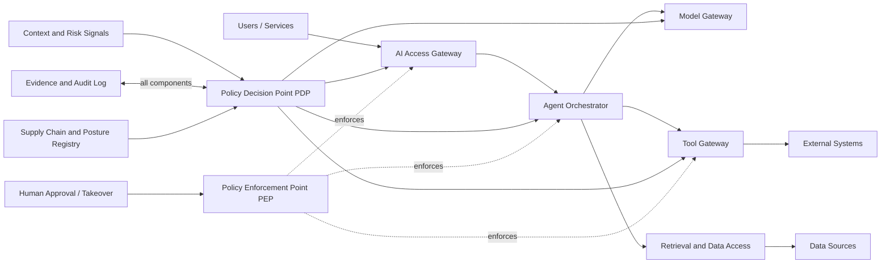

# AI Zero Trust Alliance: High-Level Design (HLD)

**Status**: Draft v0.2
**Scope**: AI systems, agents, models, data, tools, and supply chains used by enterprises and public institutions

## 1. Mission and Positioning

The AI Zero Trust Alliance (AIZTA) is an open standards organization modeled on industry benchmark bodies. It maintains AI zero trust baselines, control requirements, implementation guidance, assessment methods, and certification programs.

AIZTA complements laws, sector regulations, ISO standards, NIST guidance, and other frameworks. It adds a verifiable control layer for AI-specific risks:

- Models and agents generate behavior dynamically and cannot be trusted based only on static identity.
- Prompts, context, tool calls, and outputs are all potential attack surfaces.
- Models, datasets, plugins, vendors, and runtimes form one supply chain.
- High-impact outputs require explainability, traceability, revocation, and human takeover.

### 1.1 Design Principles

1. **Never trust by default**: Re-evaluate every session, tool call, data access, and high-risk output.
2. **Verify behavior, not identity alone**: Identity is necessary but not sufficient.
3. **Least privilege and least context**: Grant only the permissions, data, and tools required for the current task.
4. **Policy as code, evidence as an asset**: Version policies and make decisions reproducible from evidence.
5. **Human control**: High-impact actions must support blocking, approval, revocation, and accountability.
6. **Secure failure**: When policy services, risk signals, or dependencies fail, deny high-risk actions.

## 2. Scope and Trust Boundaries

The standard covers six object classes:

| Class | Examples | Primary risks |
|---|---|---|
| Subjects | Users, services, AI agents, batch jobs | Impersonation, privilege drift |
| Models | Foundation, fine-tuned, embedding models | Backdoors, excessive capability, version drift |
| Data | Training sets, knowledge bases, prompts, outputs | Disclosure, poisoning, cross-tenant access |
| Tools | APIs, databases, code runners, plugins | Indirect prompt injection, destructive actions |
| Runtime | Orchestrators, gateways, sandboxes, endpoints | Policy bypass, escape, missing traceability |
| Supply chain | Model/data vendors, plugins, cloud services | Third-party compromise, unknown provenance |

The primary trust boundaries are between users and agents, agents and models, agents and tools, retrieval and data, and platforms and suppliers. Neither side may establish trust solely from network location or session history.

## 3. Organization and Governance

### 3.1 Organization Structure

- **Board of Directors**: Approves the mission, conflict-of-interest rules, major releases, and budget.
- **Standards Committee**: Maintains terminology, architecture, controls, and version compatibility.
- **Technical Working Group**: Develops reference implementations, test vectors, threat models, and automation.
- **Industry Working Groups**: Develop sector profiles for finance, healthcare, government, education, and other domains.
- **Assessment and Certification Committee**: Defines assessment rules, accredits assessors, and handles appeals.
- **Secretariat**: Manages releases, change records, membership, public comments, and vulnerability disclosure.

### 3.2 Transparency Requirements

Specifications, controls, change records, responses to public comments, and certification revocations should be public. Committee members must disclose conflicts of interest. A vendor may not solely approve interpretations that affect certification of its own products.

### 3.3 Standards Publications

| Publication | Purpose |
|---|---|
| AIZTA Framework | Principles, terminology, reference architecture, and maturity model |
| AIZTA Controls | Testable controls, responsible parties, evidence, and exception rules |
| Implementation Profiles | Control subsets for sectors, organization sizes, and risk levels |
| Assessment Methodology | Test procedures, sampling, scoring, and reporting format |
| Reference Implementation | Example policy decision points, evidence stores, and test adapters |
| Threat Catalog | AI attack scenarios, prerequisites, detection, and mitigation |

## 4. Reference Architecture

### 4.1 Logical Planes

- **Interaction plane**: Authentication, sessions, prompt filtering, output handling, and user notifications.
- **Decision plane**: Policy administration, risk scoring, authorization decisions, and human approval.
- **Enforcement plane**: PEPs, model and tool gateways, sandboxes, and data access proxies.
- **Evidence plane**: Tamper-evident decision logs, asset inventories, test results, and incident correlation.
- **Governance plane**: Asset registration, risk classification, controls, exceptions, suppliers, and certification lifecycle.

## 5. Trust Decision Model

Every sensitive operation is evaluated using:

`Decision = Policy(subject, action, resource, context, risk, evidence)`

Context should include subject identity and authentication strength, agent task origin, model version, prompt and context provenance, data classification, tool target, tenant, device/network posture, time, historical anomalies, and policy version.

Decision effects are limited to:

- **Allow**: Permit with scope, lifetime, and audit requirements.
- **Allow with constraints**: Reduce capability, redact data, enforce read-only mode, apply quotas, or require approval.
- **Deny**: Reject and record the reason.
- **Quarantine**: Isolate the subject, context, model, or tool pending investigation.

## 6. Risk and Maturity

### 6.1 Action Risk

| Level | Examples | Default requirements |
|---|---|---|
| R0 | Public information questions | Identity and basic audit |
| R1 | Internal retrieval and low-impact generation | Data boundaries and output detection |
| R2 | Modifying business data or sending external messages | Strong authentication, confirmation, revocation |
| R3 | Financial, medical, production-control, or code-release actions | Human approval, dual review, isolated execution |
| R4 | Large-scale automation or irreversible high-impact decisions | Prohibited by default; special assessment and regulatory approval |

### 6.2 Organizational Maturity

- **L1 Baseline**: Asset inventory, identity, least privilege, logging, and basic supply-chain management.
- **L2 Managed**: Continuous risk assessment, policy as code, automated tests, incident response, and exception governance.
- **L3 Verifiable**: Reproducible decisions, evidence integrity, red-team tests, independent assessment, and cross-tenant isolation validation.
- **L4 Adaptive**: Continuous signals, automated downgrade/isolation, control-effectiveness metrics, and approved automated remediation.

## 7. Control Domains

| Domain | Coverage | Prefix |
|---|---|---|
| Governance and scope | Accountability, risk, exceptions, asset registration | AZT-GOV |
| Identity and subjects | Users, agents, services, strong authentication | AZT-IDENT |
| Policy and authorization | PDP/PEP, least privilege, separation of duties | AZT-POL |
| Data and context | Classification, provenance, redaction, tenant isolation | AZT-DATA |
| Models and agents | Model inventory, capability boundaries, agent behavior | AZT-MODEL |
| Tools and execution | Registration, parameter validation, sandboxing, rollback | AZT-TOOL |
| Supply chain | Provenance, signatures, versions, third-party risk | AZT-SUP |
| Observability | Decision evidence, detection, alerting, retention | AZT-OBS |
| Response | Revocation, isolation, forensics, recovery | AZT-RESP |
| Independent assessment | Testing, scoring, certification, disclosure | AZT-ASSESS |

## 8. Non-Functional Objectives

- Every R2+ decision must be reproducible during an audit, including policy, model, data, and tool versions.
- PEPs must not rely on a single client-side check; critical controls belong at server-side boundaries.
- Default-deny and degraded paths must remain available during dependency failures.
- Logs must support tenant isolation, data minimization, integrity verification, and configurable retention.
- Each specification release should include machine-readable controls, test cases, and migration notes.

## 9. Adoption Roadmap

1. **Phase 0: Governance launch**: Charter, terminology, threat model, scope, and pilot organizations.
2. **Phase 1: Baseline controls**: Identity, asset registries, PDP/PEP, audit, and R0-R1 profiles.
3. **Phase 2: High-risk closure**: R2-R3 approvals, sandboxes, revocable actions, supply-chain attestations, and automated assessment.
4. **Phase 3: Ecosystem interoperability**: Public test suites, assessment bodies, sector profiles, and certification marks.

## 10. Open Decisions

- Legal registration, membership fees, intellectual property, and certification trademark rules.
- Whether to standardize on OPA/Rego, Cedar, or provide multiple policy adapters.
- Evidence-signing format, log interoperability format, and cross-organization trust anchors.
- Regulatory mappings and certification accountability for R4 high-impact scenarios.
