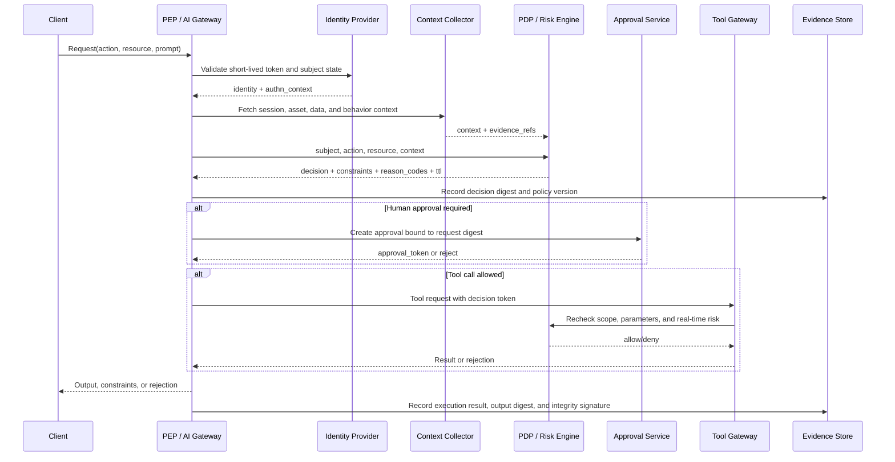

# AI Zero Trust Alliance: Low-Level Design (LLD)

**Status**: Draft v0.2
**Parent design**: [AI Zero Trust HLD](AI-Zero-Trust-HLD.md)
**Goal**: Turn the AIZTA baseline into a deployable, testable, and auditable reference implementation

## 1. Component Responsibilities

| Component | Responsibility | Key constraint |
|---|---|---|
| Identity Provider | User, service, and agent identities; short-lived tokens | OIDC/SPIFFE; agents may not share long-lived user keys |
| Asset Registry | Models, agents, data, tools, suppliers, and versions | Every asset has an owner, risk level, and status |
| Context Collector | Session, device, provenance, data, and behavior signals | Minimize collection; use references or digests for sensitive values |
| Policy Administration Point | Versioned policy authoring, review, and release | Two-person approval; releases are immutable |
| Policy Decision Point | Computes Allow, Constrain, Deny, or Quarantine | Missing policy/evidence/dependency means deny for high risk |
| Policy Enforcement Point | Enforces decisions at gateways and tool boundaries | Cannot trust a result self-reported by a model or client |
| Risk Engine | Aggregates static risk and real-time signals | Returns reason codes and expiry, not only a score |
| Model Gateway | Routing, version pinning, input/output checks, and quotas | Unregistered models cannot process protected data |
| Tool Gateway | Registration, schema validation, authorization, timeout, rollback | Authorize every call independently; read-only by default |
| Data Access Proxy | Query authorization, row/column filtering, redaction, tenant isolation | Models cannot connect directly to data sources |
| Approval Service | R2/R3 approval, dual review, expiry, and revocation | Approval binds to a digest, scope, and TTL |
| Evidence Store | Decisions, policies, input digests, execution results, signatures | Append-only/WORM; redact or reference sensitive content |
| Response Service | Revoke tokens, disable assets, isolate sessions, recover | Response actions are themselves authorized and audited |

## 2. End-to-End Decision Flow



## 3. Decision Objects

### 3.1 Request Object

```json
{
  "request_id": "req_01J...",
  "tenant_id": "tenant-a",
  "subject": {"type": "agent", "id": "agent.support", "delegated_by": "user_123"},
  "action": "ticket.update",
  "resource": {"type": "ticket", "id": "ticket_456", "classification": "confidential"},
  "session": {"id": "sess_789", "purpose": "customer-support", "trace_id": "trace_abc"},
  "asset_refs": {"model": "model:gpt-x@2026-01", "tool": "tool:ticket-api@3"},
  "context_refs": ["ctx:device-1", "ctx:prompt-source-2"],
  "requested_constraints": {"max_records": 1}
}
```

### 3.2 Decision Response

```json
{
  "decision_id": "dec_01J...",
  "effect": "allow_with_constraints",
  "constraints": {
    "scope": ["ticket:ticket_456"],
    "fields": ["status", "public_comment"],
    "approval": "required",
    "expires_at": "2026-09-21T12:05:00Z"
  },
  "reason_codes": ["RISK_R2", "DATA_CONFIDENTIAL", "TOOL_REGISTERED"],
  "policy": {"id": "pol-support-07", "version": 12},
  "evidence_refs": ["ev_01J..."],
  "issued_at": "2026-09-21T12:00:00Z"
}
```

## 4. Minimum Interface Contract

| Method | Path | Purpose | Authentication |
|---|---|---|---|
| `POST` | `/v1/decisions` | Request one authorization decision | mTLS + workload token |
| `POST` | `/v1/decisions/{id}/recheck` | Re-evaluate before tool execution | Decision token |
| `POST` | `/v1/approvals` | Create a human approval | Strong user authentication |
| `POST` | `/v1/approvals/{id}/approve` | Approve the bound request digest | WebAuthn/enterprise MFA |
| `POST` | `/v1/tools/{tool}/invoke` | Invoke a tool through the gateway | Decision token |
| `POST` | `/v1/evidence` | Write an evidence event | Workload identity |
| `POST` | `/v1/response/revoke` | Revoke a token or session | Break-glass + dual review |
| `GET` | `/v1/assets/{id}` | Read asset posture and version | Workload identity |

Error responses must include `request_id`, a stable `error_code`, and a user-understandable `message`. Never echo protected prompts, tokens, or complete sensitive records.

## 5. Policy Model

Policies must match subject, action, resource, context, and risk. A role alone must never grant an agent broad, reusable authority. Example:

```yaml
id: pol-support-07
version: 12
effect: allow_with_constraints
when:
  subject.type: agent
  subject.id: agent.support
  action: ticket.update
  resource.classification: [public, internal, confidential]
  risk.level: "<=R2"
  asset.tool.status: approved
constraints:
  require_approval: "resource.classification == confidential"
  allowed_fields: [status, public_comment]
  max_records: 1
  ttl: 5m
on_missing_signal: deny
```

Production policy release requires code review, static validation, conflict detection, test-vector success, approval signatures, and a rollback version.

## 6. Core Controls

Controls use `AZT-domain-number`. Each control defines an owner, implementation requirement, test method, evidence, and exception expiry.

| ID | Requirement | Minimum evidence |
|---|---|---|
| AZT-IDENT-001 | Users, services, and agents use unique, short-lived, revocable identities | IdP configuration, token TTL, revocation records |
| AZT-IDENT-002 | Agent permissions bind to the delegating user, task purpose, and scope | Delegation token, task record |
| AZT-POL-001 | Every R1+ operation receives a PDP decision enforced by a PEP | Decision logs, PEP integration tests |
| AZT-POL-002 | Missing, expired, or unavailable critical signals deny high-risk actions by default | Failure exercise, denial logs |
| AZT-DATA-001 | Data access is minimized and redacted by tenant, classification, and purpose | Access policies, redaction tests |
| AZT-DATA-002 | External prompts, retrieved content, and tool results are untrusted inputs | Injection tests, provenance labels |
| AZT-MODEL-001 | Production models are version-pinned with provenance, evaluation, and change records | Model inventory, digest, approval |
| AZT-MODEL-002 | Agents cannot expand their own tool, data, or permission set | Tool allowlist, privilege tests |
| AZT-TOOL-001 | Tool calls validate schema, resource scope, TTL, and idempotency before execution | Gateway logs, negative tests |
| AZT-TOOL-002 | R2/R3 actions support approval, revocation, rollback, or compensation | Approval records, recovery exercise |
| AZT-SUP-001 | Models, datasets, plugins, and dependencies have provenance and integrity evidence | SBOM/MLBOM, signature verification |
| AZT-OBS-001 | Decision logs correlate subject, policy, model, data, tool, and result | Reproducible audit sample |
| AZT-RESP-001 | Agents, tokens, tools, and sessions can be revoked within a defined time | Exercise report, RTO metric |
| AZT-ASSESS-001 | Pre-release testing covers prompt injection, data leakage, privilege abuse, and tool misuse | Test report, defect disposition |

## 7. Evidence Event Format

Evidence events use append-only JSON. Production implementations should use an organization-wide time source, event signatures, and encrypted transport:

```json
{
  "event_id": "ev_01J...",
  "event_type": "authorization.decision",
  "occurred_at": "2026-09-21T12:00:00Z",
  "tenant_id": "tenant-a",
  "trace_id": "trace_abc",
  "subject_ref": "agent:support",
  "asset_refs": ["model:gpt-x@2026-01", "tool:ticket-api@3"],
  "policy_ref": "pol-support-07@12",
  "effect": "allow_with_constraints",
  "reason_codes": ["RISK_R2"],
  "input_digest": "sha256:...",
  "output_digest": "sha256:...",
  "integrity": {"algorithm": "Ed25519", "signature": "base64:..."}
}
```

Raw prompts, complete outputs, and personal data do not belong in ordinary audit logs by default. Controlled references may be used for forensics, with access to those references logged separately.

## 8. Testing and Assessment

### 8.1 Automated Test Gates

- Identity: forged tokens, expired tokens, broken delegation chains, and cross-tenant access.
- Policy: default deny, policy conflicts, TTL expiry, rollback, and unavailable PDP.
- AI input: direct and indirect prompt injection, unauthorized instructions, and sensitive-data extraction.
- Tools: parameter pollution, target replacement, replay, duplicate execution, and destructive calls.
- Data: training/retrieval poisoning, unauthorized retrieval, redaction bypass, and cross-tenant cache access.
- Supply chain: digest mismatch, unapproved models, malicious plugins, and vulnerable dependencies.

### 8.2 Assessment Results

Each control returns `pass`, `partial`, `fail`, or `not_applicable`, with evidence references, test time, asset version, and exception ID. An organization may not claim L3 when any R3 control is `fail`.

## 9. Operations and Failure Handling

- PDP available but risk engine unavailable: allow R0, degrade R1, and deny or route R2+ to human approval.
- PEP unavailable: block tool execution; clients may not connect directly to backend tools.
- Evidence Store unavailable: allow low-risk, side-effect-free requests; block auditable R2/R3 actions.
- Model or tool integrity anomaly: quarantine the asset, revoke related decision tokens, and preserve forensic references.
- Break-glass is reserved for response and recovery, requires short lifetime and dual approval, and is reviewed afterward.

## 10. Versioning and Compatibility

Control IDs are never reused. Behavioral changes create a new version with migration notes. Policies, models, tools, and assessment reports record the framework version. A major version may change default-deny behavior or evidence contracts and requires compatibility assessment. A minor version adds optional controls or clarifies test methods.
